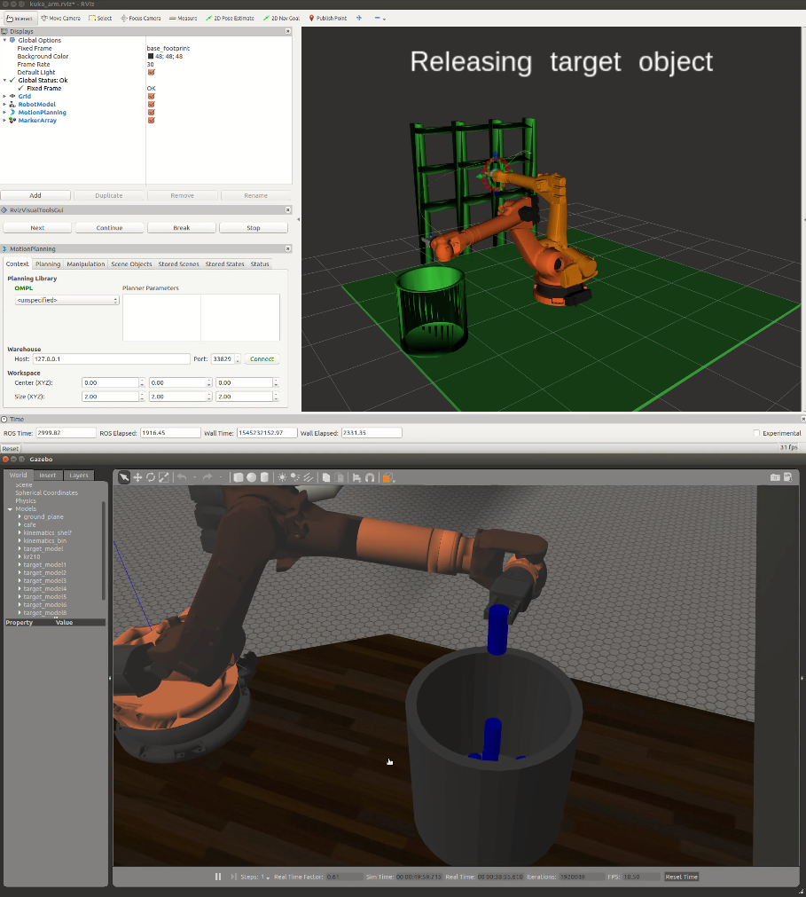

# Project: Kinematics Pick & Place

[//]: # (Image References)
[img_dhparam]: ./misc_images/DHparam.png
[img_bin]: ./misc_images/bin.png
[img_rviz]: ./misc_images/rviz.png
[img_theta123]: ./misc_images/Theta123.png
[img_theta456]: ./misc_images/Theta456.png
[img_project]: ./misc_images/Project.png
[img_project2]: ./misc_images/Project2.png
[gif_pile]: ./misc_images/Pile.gif

## Project Report

The project uses the Kuka KR210 robotic arm to pick and place objects in a simulated environment. To accomplish this task it is necessary to realize kinematic analysis and implement code for executing it. This report describes the analysis and key points observed along the project.

![alt text][img_project]
![alt text][img_project2]

### Kinematic Analysis
#### 1. Run the forward_kinematics demo and evaluate the kr210.urdf.xacro file to perform kinematic analysis of Kuka KR210 robot and derive its DH parameters.

After installing ROS and getting familiar with the environment, the first step is to sketch the robot arm in its initial pose. For this task, the rviz package is particularly useful to visualize each link and joints. The possibility to quickly follow the numerical values for the coordinates also facilitates debugging.


![alt text][img_rviz]

The file kr210.urdf.xacro describes the robot model for the simulator. Inspecting it, was possible to find the position for each joint and determine the numerical values for link lengths.

```
  <joint name="fixed_base_joint" type="fixed">
    <origin xyz="0 0 0" rpy="0 0 0"/>
  <joint name="joint_1" type="revolute">
    <origin xyz="0 0 0.33" rpy="0 0 0"/>
  <joint name="joint_2" type="revolute">
    <origin xyz="0.35 0 0.42" rpy="0 0 0"/>
  <joint name="joint_3" type="revolute">
    <origin xyz="0 0 1.25" rpy="0 0 0"/>
  <joint name="joint_4" type="revolute">
    <origin xyz="0.96 0 -0.054" rpy="0 0 0"/>
  <joint name="joint_5" type="revolute">
    <origin xyz="0.54 0 0" rpy="0 0 0"/>
  <joint name="joint_6" type="revolute">
    <origin xyz="0.193 0 0" rpy="0 0 0"/>
  <joint name="gripper_joint" type="fixed">
    <origin xyz="0.11 0 0" rpy="0 0 0"/><!--0.087-->
```
Following the steps explained in the lectures the Denavit–Hartenberg parameters can be calculated. The results are shown below.

![alt text][img_dhparam]

Using numerical values the DH parameter table was defined as follows

Links   | alpha(i-1) | a(i-1) | d(i-1) | theta(i)
------- | ---------- | ------ | ------ | --------
0 -> 1  |  0         |  0     | 0.75   | q1
1 -> 2  | -pi/2      |  0.35  | 0      | q2 -pi/2
2 -> 3  |  0         |  1.25  | 0      | q3
3 -> 4  | -pi/2      | -0.054 | 1.5    | q4
4 -> 5  |  pi/2      |  0     | 0      | q5
5 -> 6  | -pi/2      |  0     | 0      | q6
6 -> G  |  0         |  0     | 0.303  | 0


#### 2. Using the DH parameter table you derived earlier, create individual transformation matrices about each joint. In addition, also generate a generalized homogeneous transform between base_link and gripper_link using only end-effector(gripper) pose.

Each individual transformation matrices is displayed below. It was calculated with the supporting code [FK_Eval.py](./FK_eval.py). It is possible to observe how they represent clear rotations and translation for each link and joint. 
```
T0_1
[cos(q1), -sin(q1), 0,    0],
[sin(q1),  cos(q1), 0,    0],
[      0,        0, 1, 0.75],
[      0,        0, 0,    1]

T1_2
[ cos(q2), -sin(q2), 0, 0.35],
[       0,        0, 1,    0],
[-sin(q2), -cos(q2), 0,    0],
[       0,        0, 0,    1]

T2_3
[cos(q3), -sin(q3), 0, 1.25],
[sin(q3),  cos(q3), 0,    0],
[      0,        0, 1,    0],
[      0,        0, 0,    1]

T3_4
[ cos(q4), -sin(q4), 0, -0.054],
[       0,        0, 1,    1.5],
[-sin(q4), -cos(q4), 0,      0],
[       0,        0, 0,      1]

T4_5
[cos(q5), -sin(q5),  0, 0],
[      0,        0, -1, 0],
[sin(q5),  cos(q5),  0, 0],
[      0,        0,  0, 1]

T5_6
[ cos(q6), -sin(q6), 0, 0],
[       0,        0, 1, 0],
[-sin(q6), -cos(q6), 0, 0],
[       0,        0, 0, 1]

T6_g
[1, 0, 0,     0],
[0, 1, 0,     0],
[0, 0, 1, 0.303],
[0, 0, 0,     1]

Trx
[1,  0,  0, 0],
[0, -1,  0, 0],
[0,  0, -1, 0],
[0,  0,  0, 1]

('Try
[ 0, 0, 1, 0],
[ 0, 1, 0, 0],
[-1, 0, 0, 0],
[ 0, 0, 0, 1]

('Trot
[0,  0, 1, 0],
[0, -1, 0, 0],
[1,  0, 0, 0],
[0,  0, 0, 1]

```

The generalized homogeneous transform can be calculated by combining each individual matrices. It is also necessary to use an additional rotation (Trot) to compensate the difference in axis used in the analysis and the gazebo simulation environment.

```
T0_g = (T0_1 * T1_2 * T2_3 * T3_4 * T4_5 * T5_6 * T6_g * Trot)
```


#### 3. Decouple Inverse Kinematics problem into Inverse Position Kinematics and inverse Orientation Kinematics; doing so derive the equations to calculate all individual joint angles.

In order to make geometric analysis, it was necessary to kinematically decouple the IK problem into Inverse Position and Inverse Orientation. This is possible because the robot has a spherical wrist composed by joints 4,5 and 6 and its position is determined by joints 1,2 and 3.

The analysis below shows the steps to determine equations for each joint angle (theta1, 2, 3, 4, 5 and 6).
![alt text][img_theta123]
![alt text][img_theta456]


### Project Implementation

#### 1. Fill in the `IK_server.py` file with properly commented python code for calculating Inverse Kinematics based on previously performed Kinematic Analysis. Your code must guide the robot to successfully complete 8/10 pick and place cycles. Briefly discuss the code you implemented and your results. 

Initially the [IK_debug.py](./IK_debug.py) script was used to quickly implement the equations. When the small errors were achieved, the final implementation was done in the file [IK_server.py](./kuka_arm/scripts/IK_server.py). It contains comments to explain each step.

##### Main challenges
* Setup ROS demanded considerable time especially due to previously installed and conflicting libraries and locale variables that interfered with gazebo display. Mentor support was helpful to overcome this challenges faster. 
* Visualize and track relevant variables in the calculation was difficult. Making drawings and sketches was crucial along the project.
* The gripper failed to grasp the cylinder a few times. Reason was not investigated.

##### Results 
The implementation works and completes the goal. Success rate observed was 9/10. 
Click the image bellow to watch a video.
[](https://youtu.be/NrDVibByEmE)

##### Future work 
* Improve geometric analysis to select the best angle possible and avoid unnecessary rotation.
* Optimize code to remove calculations that are not required every time IK_server is invoked

##### Additional comments

Despite the challenges and the hard time to remember algebra and geometry concepts, the project was fun and enjoyable. It was strangely pleasant to watch them cylinders pile up inside the bin until they all eventually fall. 

![alt text][gif_pile]


